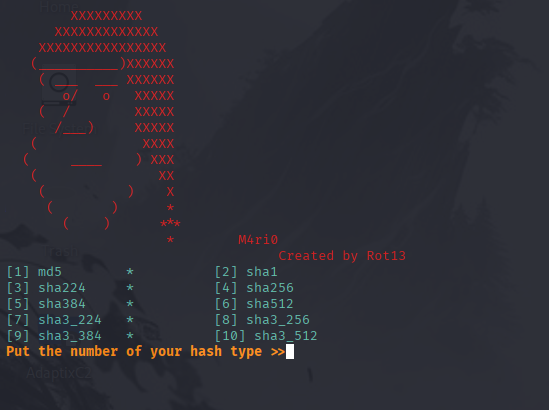

# M4ri0 Hash Cracker 🔥


## Description

M4ri0 is a Python command-line tool to **crack hashes** using a wordlist.  
Supports hash types:

- MD5
- SHA1
- SHA224
- SHA256
- SHA384
- SHA512
- SHA3_224
- SHA3_256
- SHA3_384
- SHA3_512

---

## Features

- Command-line interface with banner.
- Supports 10 different hash types.
- Reads wordlists and cracks hashes efficiently.
- Compatible with Python 3.x.
- Easy to extend with more hash types.

---

## Installation

```bash
# Clone the repository
git clone https://github.com/R4vas/Mario.git
cd Mario

# Install dependencies (optional)
pip install -r requirement.txt

# Run the tool
python3 mario.py
